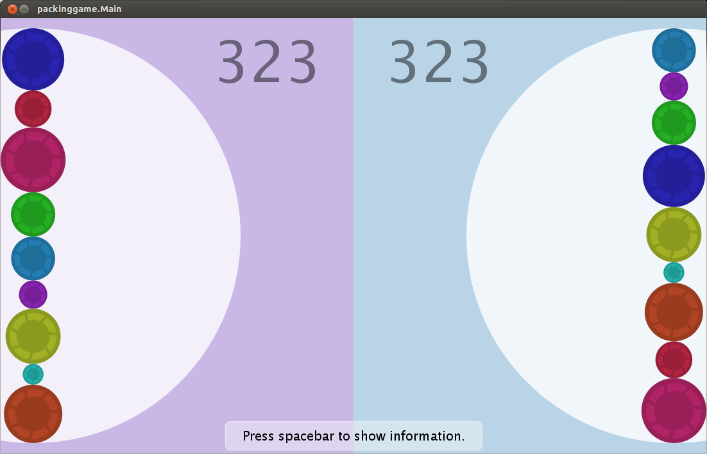
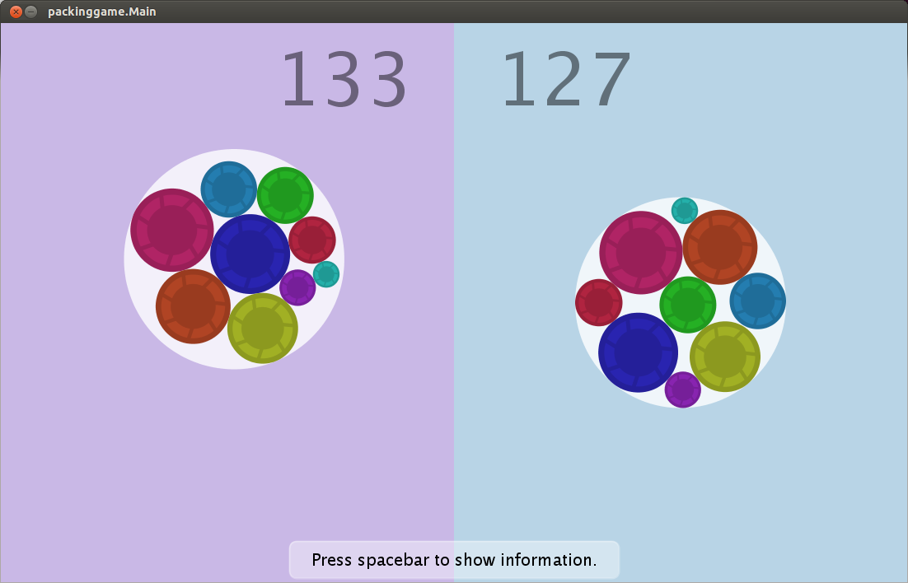
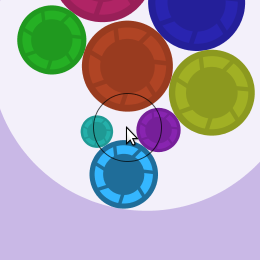

# "Packing game"

**CS 6491, Computer graphics, Fall 2012**

[Paper](http://chris-martin.github.io/packing-game/packing.pdf)

Arrange a finite set of disks such that none of them overlap, with
the goal of minimizing the radius of the circle that circumscribes them.





Building
--------

An ant ```build.xml``` is provided. From the java/ directory:

Run ```ant build-jar``` to construct an executable jar.

Run ```ant run``` to run the application.

